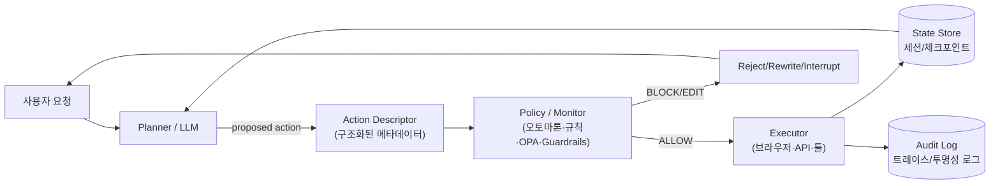
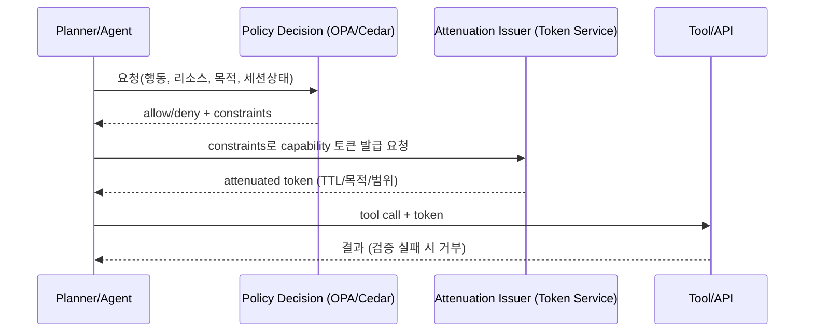
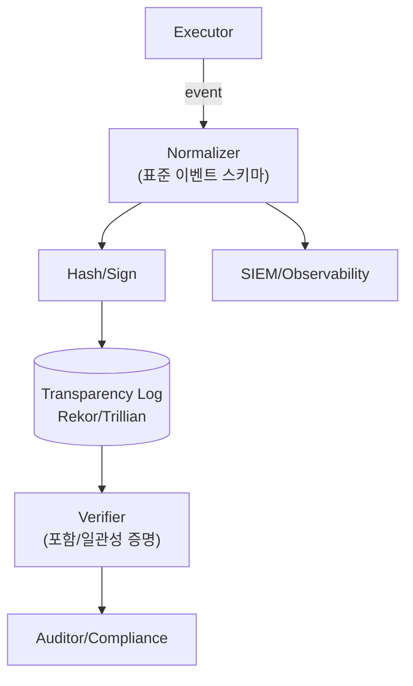

이번 달 Editors Pick은, Google이 Gemini 3에 왜 ‘350번의 공격’을 먼저 퍼부었는지에서 시작했습니다.
솔직히 말하면 “왜 굳이 그렇게까지?”가 궁금했거든요.

답은 의외로 단순했습니다.
Google은 안전을 “기능 하나”로 보지 않고, 처음부터 끝까지 흐름으로 묶어 관리하고 있었습니다.

Research → Policies & Frameworks → Testing → Mitigation → Launch Review → Monitoring & Enforcement → Governance Forums.
이 7단계가 사실상 안전의 ‘제작 공정표’처럼 작동해요.

Gemini 3에는 Frontier Safety Framework가 적용됐고, CART가 2025년에 350건 이상 레드팀 훈련을 했습니다.
여기에 Apollo·Vaultis·Dreadnode 같은 외부 기관에 사전 접근권까지 열어주면서, “우리끼리만 검사한 거 아니다”라는 신호도 분명히 줬고요.

제가 제일 재미있게 본 건 에이전틱 AI 보안 설계였습니다.
Chrome 에이전트 쪽은 특히 “그럴듯한 통제”가 아니라, 실제로 끊어낼 수 있는 레이어를 겹겹이 올려놨어요.

먼저 User Alignment Critic으로 행동을 따로 심사하고,

Agent Origin Sets로 갈 수 있는 오리진을 작업 범위로 묶고,

민감한 순간에는 human oversight로 사람이 한 번 더 잡아주는 구조죠.

여기서 끝이 아니라, 인터랙티브 샌드박스와 Buddy Agents로 멀티턴 공격 환경 자체를 실험하고, harmful manipulation CCL까지 붙여서 임계치를 넘으면 추가 안전 조치가 자동으로 걸리게 해뒀습니다.

결국 제 결론은 이거예요.
이제는 “에이전트를 잘 만든다”보다, 에이전트를 감시하는 구조가 더 중요해졌고, 더 나아가 그 감시를 또 시험하는 구조까지 있어야 신뢰가 굴러갑니다.

그래서 뒤의 내용을 따로 조사했습니다.
Google 사례를 보면서 확신이 들었거든요. 앞으로의 핵심은 “좋은 모델”이 아니라 행동을 런타임에서 어디까지 강제로 묶을 수 있느냐라는 쪽으로 옮겨갈 가능성이 큽니다. 즉, 에이전트가 툴을 호출하고 브라우저를 조작하고 외부 시스템에 흔적을 남기기 직전/직후에, **허용된 상태 전이만 통과시키는 장치(정지·승인·교정)**가 필요해져요. 그래서 “허용 상태 전이 그래프”와 “런타임 강제(실드/가드레일/모니터링)” 쪽 연구 흐름을 같이 붙여서 보게 됐습니다.

참고: https://ai.google/static/documents/ai-responsibility-update-2026.pdf

---

# AI 에이전트의 허용 상태 전이 그래프와 런타임 강제 연구 동향

## 요약

“허용 가능한 상태 전이 그래프(allowable state transition graph)”를 **형식적으로 정의**하고, 에이전트가 실제로 행동(툴 호출·브라우저 조작·API 부작용)을 하기 전/후에 **런타임에서 강제(enforce)·모니터링(monitor)·교정(edit/shield)**하는 접근은 이미 오래된 분야(런타임 강제·런타임 검증·실드/쉴딩)에서 정립되어 왔습니다. 특히 보안/형식기법에서는 허용 가능한 실행(trace)을 **오토마톤(보안 오토마톤, 편집 오토마톤)**으로 정의하고, 이를 런타임에서 **중단/억제/삽입** 등으로 강제할 수 있음을 이론과 구현으로 보여줍니다. [\[1\]](https://web.cs.wpi.edu/~guttman/cs557_website/papers/schneider_enforceable.pdf)

최근(2024–2026)에는 이 전통이 **LLM 기반 에이전트**로 “재수입”되고 있습니다. 대표적으로 AgentSpec(=AgentSpec DSL)는 트리거·조건·집행 규칙을 명시해 툴 사용/코드 실행/물리 에이전트 등에서 런타임 강제를 제공하고, Pro2Guard는 에이전트 행동을 **기호 상태(symbolic state) 전이**로 추상화하여 DTMC(이산시간 마르코프체인) 기반의 **확률적 예측 \+ 선제 개입**을 수행합니다. [\[2\]](https://arxiv.org/html/2503.18666)

산업 문서/제품 관점에서 “완전한 상태 전이 그래프”를 공식적으로 공개하는 경우는 드뭅니다. 대신 (a) **툴 호출 승인/가드레일**, (b) **세션·권한·오리진(Origin) 기반 경계**, (c) **상태 저장/재개(체크포인트)**, (d) **감사 가능한 로그/출처(provenance)** 같이, 상태 전이 그래프를 구성하는 **부분 요소를 운영 가능한 형태로 제공**하는 경향이 강합니다. 예를 들어 Google Chrome의 에이전틱 기능 보안 설계는 “행동을 별도 고신뢰 모델이 검토(User Alignment Critic)”하고, “작업 관련 오리진만 접근(Agent Origin Sets)”하며, 중요한 단계는 사용자 확인을 요구합니다. [\[3\]](https://security.googleblog.com/2025/12/architecting-security-for-agentic.html) OpenAI Agents SDK는 Guardrails 및 Human-in-the-loop로 실행을 **중단·재개**하고, RunState로 상태를 직렬화해 승인 후 이어서 실행하는 흐름을 제공합니다. [\[4\]](https://openai.github.io/openai-agents-js/guides/human-in-the-loop/) LangGraph는 노드/엣지로 “허용 전이”를 그래프 구조로 표현하고, 체크포인터로 **매 super-step 상태를 저장**하며, interrupt로 외부 입력(승인)을 기다리는 **제어 가능한 상태기계 런타임**을 제공합니다. [\[5\]](https://docs.langchain.com/oss/python/langgraph/graph-api)

이 보고서는 (1) 학술 원전(오토마톤 기반 강제, 런타임 검증, 실드, 에이전트 검증, LLM 에이전트 런타임 강제), (2) 산업 문서(구글/오픈AI/마이크로소프트/브라우저·에이전트 런타임), (3) 오픈소스 도구(정책 엔진 OPA/Cedar, capability 토큰 Macaroons, tamper-evident 로그 Rekor/Trillian, provenance in-toto/SLSA, 런타임 모니터 JavaMOP/RTAMT/Linux RV 등)를 기반으로, **네 가지 “에이전트 상태”**(모델 내부·브라우저·외부 시스템·사용자 인지) 관점의 적용 가능성과 한계를 비교합니다.

## 개념 정리

### 허용 상태 전이 그래프란 무엇인가

이 보고서에서 “허용 가능한 상태 전이 그래프”는 다음을 의미합니다.

* 시스템(에이전트)의 실행을 **상태(state)와 이벤트/행동(action/event)**의 시퀀스로 본 뒤, “허용되는 전이만 통과시키는 규칙”을 **그래프/오토마톤/논리(temporal logic)로 명시화**한 것

* 런타임에서 에이전트가 어떤 행동을 하려 할 때, **현재 상태 \+ 예정 행동 \+ (선택적으로) 일정 범위의 미래 예측**을 바탕으로 “허용/거부/교정/중단”을 결정하는 것

전통 보안/형식기법에서는 이를 “허용 실행(trace)의 집합”으로 규정하고, 보안 정책을 오토마톤(보안 오토마톤/편집 오토마톤)으로 표현해 런타임에 강제할 수 있음을 정리합니다. [\[6\]](https://web.cs.wpi.edu/~guttman/cs557_website/papers/schneider_enforceable.pdf) 강화(enforcement)의 힘은 단순 중단(terminate)부터, 특정 행동 억제(suppress), 추가 행동 삽입(insert)까지 확장됩니다. [\[7\]](https://cse.usf.edu/~ligatti/papers/TR-681-03.pdf)

### 네 가지 에이전트 상태 타입

본 요청에서 제시한 네 상태 타입을 다음처럼 구체화합니다.

* **모델 내부 상태**: LLM의 ‘생각’(내부 추론), 계획 단계, 툴 선택 논리, 은닉된 목표/중간 의도(일반적으로 직접 관측 불가). “관측 가능한 내부 상태”는 대개 메시지/툴콜/트레이스 등으로 **외부화된 일부**에 한합니다. [\[8\]](https://arxiv.org/html/2506.07153)

* **브라우저 상태**: 탭/URL 내비게이션, DOM/접근성 트리 스냅샷, 쿠키·로컬스토리지·세션, 서비스 워커 등. 오픈소스 브라우저 에이전트 런타임은 세션별 쿠키/스토리지 분리, 상태 저장/복원, 만료/암호화 같은 기능을 제공합니다. [\[9\]](https://github.com/vercel-labs/agent-browser)

* **외부 시스템 상태**: 이메일 발송, 결제, 데이터베이스 변경, 파일 삭제, 원격 API 부작용(side effects) 등 “되돌리기 어려운” 변화.

* **사용자 인지 상태**: 사용자가 “에이전트가 무엇을 했고, 왜 했고, 다음에 무엇을 할지”를 이해/승인할 수 있는지(결정 프레이밍, 오해 유발·조작 가능성 포함). Google은 Chrome 에이전트 설계에서 사용자 확인(critical steps) 등 사용자 통제를 핵심 레이어로 둡니다. [\[3\]](https://security.googleblog.com/2025/12/architecting-security-for-agentic.html)

## 학술 연구 동향

### 런타임 강제의 원전: 보안 오토마톤과 편집 오토마톤

* **Schneider(2000) “Enforceable Security Policies”**는 보안 정책을 “허용 실행의 집합”으로 보고, 런타임에서 실행을 감시하다가 위반 직전 **중단**할 수 있는 형태의 정책(주로 safety 성질)을 “보안 오토마톤”으로 정식화했습니다. 또한 현실에서 정책을 집행하려면 단지 오토마톤이 존재하는 것뿐 아니라, 집행자가 타겟 실행을 **실제로 제어/중단할 수 있는 권한**이 필요함을 강조합니다. [\[10\]](https://web.cs.wpi.edu/~guttman/cs557_website/papers/schneider_enforceable.pdf)

* **Ligatti, Bauer, Walker(2003/2004) “Edit Automata”**는 중단만 가능한 모델보다 강한 런타임 집행을 위해, 실행 스트림을 **변환(edit)**하는 오토마톤을 정의합니다. 즉 정책 위반이 감지되면 실행을 종료하거나, 특정 행동을 억제(suppress)하거나, 필요한 행동을 삽입(insert)할 수 있어 “허용 전이 그래프”를 더 넓게 강제합니다. [\[7\]](https://cse.usf.edu/~ligatti/papers/TR-681-03.pdf)

* 최근에는 “명세(추상 이벤트) ↔ 실제 시스템(저수준 액션)”의 간극이 런타임 집행을 무력화하는 핵심 공격면이란 점을 정면으로 다루는 연구도 있습니다. 예컨대 Hublet/Basin 등(2026)은 런타임 강제에서 **계측(instrumentation)**을 명시적으로 모델링하고, 올바른 계측이 없으면 접근제어 같은 메커니즘도 쉽게 우회될 수 있음을 논의합니다. [\[11\]](https://people.inf.ethz.ch/basin/pubs/rv25.pdf)  
  → LLM 에이전트에 이식하면, “툴 호출/브라우저 클릭/DB 쓰기”를 어떤 추상 이벤트로 볼지(예: payment\_attempt, credential\_use, data\_export)가 곧 **상태 전이 그래프의 노드/엣지 정의**가 됩니다.

### 런타임 검증(Runtime Verification)과 반응형 모니터

런타임 검증은 “실행 중인 시스템이 명세를 만족하는지”를 **온라인으로 확인**하는 분야이며, 강제(enforcement)까지 포함하는 구현도 존재합니다. 예를 들어 Linux 커널 문서는 런타임 검증이 “모델을 새로 만들 필요 없이” 실제 시스템의 트레이스를 기반으로 하고, 효율적 모니터링이 가능하면 온라인 검증과 함께 예기치 않은 이벤트에 반응(로깅, 교정, 심지어 시스템 중단)할 수 있다고 설명합니다. [\[12\]](https://docs.kernel.org/trace/rv/runtime-verification.html)  
이 구조는 “참조 모델(reference model) \+ 트레이싱(instrumentation) \+ 모니터 인스턴스 \+ 리액션”으로 표현되며, 사실상 ‘허용 전이 그래프’를 참조 모델로 들고 있는 셈입니다. [\[12\]](https://docs.kernel.org/trace/rv/runtime-verification.html)

### 실드(Shielding): 상태 전이 기반 안전 행동 집합 제공

강화학습/자율 시스템에서 **실드(shield)**는 (명시된 논리 명세에 기반해) 런타임에 안전 행동만 허용하거나, 선택된 행동을 교정하는 방식입니다.

* Alshiekh 등(2017) “Safe Reinforcement Learning via Shielding”은 시간 논리(temporal logic)로 표현된 안전 속성을 준수하도록 “반응형 실드”를 합성하고, 실드가 (a) 의사결정 시점에 안전 행동 목록을 제공하거나 (b) 학습 에이전트 뒤에서 행동을 모니터링·교정할 수 있음을 설명합니다. [\[13\]](https://arxiv.org/abs/1708.08611)  
  → 이 접근은 “상태(환경/시스템) → 허용 행동”을 계산하므로, 허용 가능한 전이 그래프를 런타임에 직접 적용하는 전형적인 형태입니다.

### LLM 에이전트에서의 “상태/전이 추상화 \+ 런타임 강제” 최신 연구

최근 2년은 “LLM 에이전트도 결국 이벤트 스트림을 생성한다”는 관점에서, 위 전통을 직접 적용하려는 연구가 빠르게 늘었습니다.

* **AgentSpec (Wang, Poskitt, Sun; ICSE 2026 예정)**은 LLM 에이전트의 안전 경계를 “트리거·프레디케이트·집행(enforce)”로 구성된 DSL 규칙으로 명시합니다. 논문은 AgentSpec이 코드 에이전트에서 unsafe 실행을 높은 비율로 막고(도메인별 평가), 오버헤드가 ms 단위임을 주장합니다. [\[14\]](https://arxiv.org/html/2503.18666)

* 오픈소스 구현에서는 LangChain 기반 에이전트에 “도구 이름(이벤트) \+ 사용자 입력 \+ 툴 입력 \+ intermediate steps(이전 행동/결정)”을 받아, 파괴적 행동 여부를 판정하는 프레디케이트를 정의하고 user\_inspection 같은 집행을 걸 수 있음을 보여줍니다. [\[15\]](https://github.com/haoyuwang99/AgentSpec)

* **Pro2Guard (Wang, Poskitt, Sun, Wei; 2025\)**는 단순 규칙 기반 “사후/직전 개입”이 장기 의존성(long-horizon dependency)을 놓칠 수 있다는 문제를 제기하고, 에이전트 행동을 **기호 상태 전이**로 추상화해 실행 추적에서 DTMC를 학습합니다. 런타임에는 “향후 undesired behavior에 도달할 확률”을 예측해 임계치를 초과하면 더 이른 시점에 개입(proactive enforcement)합니다. [\[16\]](https://arxiv.org/html/2508.00500)

* **GuardAgent (Xiang et al.; ICML 2025\)**는 “규칙 검증을 하는 별도의 가드 에이전트”가 안전 요구사항을 계획으로 만들고, 이를 **실행 가능한 가드레일 코드**로 변환해 타겟 에이전트의 행동이 안전 요구를 만족하는지 동적으로 검사하는 구조를 제시합니다. [\[17\]](https://arxiv.org/abs/2406.09187)

* **ShieldAgent (Chen, Kang, Li; 2025\)**는 정책 문서에서 검증 가능한 규칙을 추출해 “행동 기반 확률적 규칙 회로”로 구성하고, 보호 대상 에이전트의 행동 궤적(action trajectory)에 대해 관련 규칙을 적용해 shielding plan을 생성하며, 도구/실행 코드로 형식 검증을 활용한다고 설명합니다. [\[18\]](https://arxiv.org/abs/2503.22738)

이 계열 연구의 공통점은 “LLM의 내부 추론을 직접 통제”하기보다는, **관측 가능한 행동(툴 호출, 궤적)과 추상 상태**를 정의하고, 그 위에서 허용 전이를 강제한다는 점입니다. [\[19\]](https://arxiv.org/html/2503.18666)

### 공격 연구가 보여주는 “전이 그래프의 필요성”과 한계

* 웹/브라우저 에이전트는 DOM 조작·다중 탭·인증 세션 접근 등으로 강력한 능력을 갖는데, 웹 페이지의 텍스트/콘텐츠에 악성 지시를 숨겨 에이전트를 조종하는 공격이 실증되고 있습니다. “Mind the Web”은 웹페이지에 삽입된 자연어 지시로 에이전트를 조종하는 기법을 제시하고, 여러 에이전트 구현에서 높은 공격 성공률과 전이성(transferability)을 보고합니다. [\[20\]](https://arxiv.org/html/2506.07153)

* 툴 호출 기반 에이전트에서도 스케줄링/툴 선택 과정이 공격면이 됩니다. ToolCommander는 툴 호출 시스템에 대한 adversarial injection을 다루며, 툴 호출 메커니즘의 취약점을 공격하는 프레임워크를 제시합니다. [\[21\]](https://arxiv.org/abs/2412.10198)

이 결과들은 “정상적인 행동 조각을 조합해 악성 목표를 달성”하는 **구성적 위험(compositional risk)**이 크다는 점을 뒷받침하며, 단일 행동 필터만으로는 부족하고 “상태/전이” 관점(예: 세션 누적 민감도, 연속된 데이터 흐름)을 강제해야 함을 시사합니다. [\[22\]](https://arxiv.org/html/2506.07153)

## 산업 문서와 제품 설계

### Google: 브라우저 에이전트에서의 오리진/행동 게이팅

Google Online Security Blog는 Chrome 에이전틱 기능 보안에서 다음 레이어를 명시합니다.

* **User Alignment Critic**: 에이전트의 예정 행동을 **별도의 모델**이 검토하며, 이 모델은 신뢰할 수 없는 콘텐츠로부터 **격리**됨(간접 프롬프트 인젝션을 완화). [\[3\]](https://security.googleblog.com/2025/12/architecting-security-for-agentic.html)

* **Agent Origin Sets**: 작업과 관련된 오리진만 접근하도록 브라우저의 오리진 격리 원칙을 확장하여, 에이전트가 무관한 오리진에서 임의로 행동하는 것을 막는 구조. [\[3\]](https://security.googleblog.com/2025/12/architecting-security-for-agentic.html)

* **User confirmations / real-time detection / red-teaming**을 포함한 다층 방어를 함께 언급합니다. [\[3\]](https://security.googleblog.com/2025/12/architecting-security-for-agentic.html)

이는 “브라우저 상태(오리진/세션) \+ 행동(action) 게이팅”을 결합한 형태로, 엄밀한 의미의 “전이 그래프”를 공개하진 않지만, 실무적으로는 **세션별 허용 오리진 집합 \+ 행동 승인기**가 곧 전이 제약을 구성합니다.

또한 Google의 SAIF(2.0) 웹사이트는 SAIF Risk Map이 AI 개발 전 과정에서 위험과 통제를 매핑한다고 설명하면서도, **해당 사이트 내용이 ‘구글의 현재 기술 구현을 반영한 것은 아니다’**라고 명시합니다. 즉 SAIF는 정책/프레임워크로 유용하지만, 이를 그대로 “제품 런타임 전이 그래프 구현”으로 해석하면 과대추정 위험이 있습니다. [\[23\]](https://www.saif.google/secure-ai-framework)

### OpenAI: 툴 호출 승인, 가드레일, 상태 직렬화/재개

OpenAI Agents SDK는 “에이전트 런타임에서의 전이 제어”를 다음 구성으로 제공합니다.

* **Guardrails**: 사용자 입력/에이전트 출력에 대한 검사·검증을 수행하며, (모드에 따라) 에러를 발생시켜 실행을 방지할 수 있습니다. [\[24\]](https://openai.github.io/openai-agents-python/guardrails/)

* **Human-in-the-loop**: 민감 툴 실행 승인 목적으로, 사람 개입에 따라 에이전트 실행을 **pause/resume**하는 내장 지원을 제공합니다. [\[25\]](https://openai.github.io/openai-agents-js/guides/human-in-the-loop/)

* GitHub 릴리스 노트에 따르면, HITL 플로우에서 툴이 needs\_approval을 선언하고, 실행 결과가 “pending approval”을 interruption으로 노출하며, RunState로 상태를 직렬화해 승인/거부 후 **동일 실행을 재개**할 수 있습니다. [\[26\]](https://github.com/openai/openai-agents-python/releases)

* 더 세밀하게는, 도구 호출 전/후에 실행되는 **Tool Input/Output Guardrail**이 존재하며, 가드레일 결과로 allow, reject\_content(툴 결과를 모델로 전달하지 않고 메시지로 대체), raise\_exception(중단) 같은 집행을 정의합니다. [\[27\]](https://raw.githubusercontent.com/openai/openai-agents-python/main/src/agents/tool_guardrails.py)

이 조합은 “상태 전이 그래프”를 직접 표준 형식으로 요구하진 않지만, **전이(툴 호출)마다 정책 검사 \+ 필요 시 중단/재개**를 가능하게 하므로, 실무적으로는 전이 그래프 강제의 핵심 부품입니다.

### Microsoft: 필터 기반 실행 파이프라인 제어와 승인 패턴

* **Semantic Kernel Filters**는 함수 호출, 프롬프트 렌더링, 자동 함수 호출(automatic function calling) 단계에서 필터를 통해 **인자/프롬프트/결과를 관찰·수정·차단**할 수 있고, 자동 함수 호출 필터는 채팅 히스토리, 실행될 함수 목록, iteration counter 등 추가 문맥을 제공하며 필요 시 프로세스를 종료할 수 있다고 설명합니다. [\[28\]](https://learn.microsoft.com/en-us/semantic-kernel/concepts/enterprise-readiness/filters)

* **Microsoft Agent Framework**의 도구 승인 문서는 함수(tool)별로 “승인 필요”를 설정하고, 에이전트 실행이 승인 요청을 반환하면 호출자가 사용자 승인/거부를 받아 같은 세션으로 재실행하는 패턴을 상세히 설명합니다. [\[29\]](https://learn.microsoft.com/en-us/agent-framework/agents/tools/tool-approval)

이는 “세션 상태 \+ 툴 전이 승인”을 표준화한 형태이며, 실무적으로는 state-transition 강제(특히 외부 시스템 부작용)를 구현하는 중요한 패턴입니다.

## 오픈소스 도구와 구현 패턴

### 그래프/상태기계 형태로 에이전트를 구성하는 프레임워크

* **LangGraph**는 상태(State), 노드(Node), 엣지(Edge)로 워크플로를 구성하며, 엣지가 현재 상태에 따라 다음 노드를 결정할 수 있고, 그래프 실행은 메시지 패싱 기반 super-step으로 동작한다고 설명합니다. [\[30\]](https://docs.langchain.com/oss/python/langgraph/graph-api)

* **Persistence(Checkpointers)**: 그래프를 체크포인터와 함께 컴파일하면 매 super-step마다 그래프 상태의 체크포인트를 저장한다고 문서화되어 있습니다. [\[31\]](https://docs.langchain.com/oss/python/langgraph/persistence?utm_source=chatgpt.com)

* **Interrupts**: interrupt()로 실행을 중지하고 외부 입력을 기다린 뒤, Command(resume=...)로 재개하는 HITL 패턴을 제공하며, 이를 위해 체크포인터와 thread ID가 필요하다고 안내합니다. [\[32\]](https://docs.langchain.com/oss/python/langgraph/interrupts?utm_source=chatgpt.com)

→ LangGraph는 “허용 가능한 전이(엣지 집합)”를 개발자가 구조로 직접 정의할 수 있다는 점에서, 요청하신 **state transition graph를 ‘명시적으로’ 갖는 쪽**에 가깝습니다. 다만 각 노드 내부의 LLM이 외부 도구를 어떻게 쓰는지는 별도 정책 엔진/가드레일과 결합해야 강한 강제가 됩니다(아래 표 참조). [\[33\]](https://docs.langchain.com/oss/python/langgraph/graph-api)

### 정책 엔진: OPA, Cedar, OpenFGA

* **OPA(Open Policy Agent)**는 스택 전반에 걸친 정책 집행을 위해 “정책을 코드로” 분리하고, 서비스가 정책 결정을 API로 질의하도록 하는 일반 목적 정책 엔진입니다. [\[34\]](https://www.openpolicyagent.org/docs?utm_source=chatgpt.com)

* OPA는 Policy API/Data API/Query API 등으로 구성된 **REST API**를 제공한다고 명시합니다. [\[35\]](https://www.openpolicyagent.org/docs/rest-api?utm_source=chatgpt.com)

* 또한 예제 문서는 웹 서버가 각 HTTP 요청마다 OPA에 단일 REST 호출로 “허용 여부”를 질의하는 패턴을 제시합니다. [\[36\]](https://www.openpolicyagent.org/docs/http-api-authorization?utm_source=chatgpt.com)  
  → 에이전트 런타임에서는 “각 툴 호출/외부 API 호출/데이터 접근”을 입력으로 넣어 **PEP(Policy Enforcement Point)**에서 OPA(PDP)에 질의하는 방식으로 전이 그래프를 강제할 수 있습니다(전이 허용/거부, 조건부 허용). [\[37\]](https://docs.aws.amazon.com/prescriptive-guidance/latest/saas-multitenant-api-access-authorization/using-opa.html?utm_source=chatgpt.com)

* **Cedar(AWS 오픈소스)**는 애플리케이션 요청 앞단에서 “Is this request authorized?”를 질의하는 형태로 권한 정책을 코드와 분리할 수 있음을 설명합니다. [\[38\]](https://docs.cedarpolicy.com/)

* **OpenFGA**는 Google Zanzibar에서 영감을 받은 관계 기반 접근제어(ReBAC) 기반의 오픈소스 “fine-grained authorization” 엔진임을 표방합니다. [\[39\]](https://openfga.dev/)

이들은 모두 “상태 전이 그래프”를 직접 도식화하진 않지만, **전이(행동) 단위의 허용 조건**을 정책으로 표현하고 런타임에서 강제하는 기반 도구입니다.

### Capability 토큰과 세션/권한 축소: Macaroons

* **Macaroons(2014, Birgisson et al.)**는 bearer credential이면서도 caveat(제약)를 내장해 “언제/어디서/누가/무엇을 위해” 권한을 행사할 수 있는지 맥락적으로 제한(attenuate)할 수 있음을 제시합니다. [\[40\]](https://theory.stanford.edu/~ataly/Papers/macaroons.pdf)  
  → 에이전트 런타임에서 “각 전이(툴 호출)”에 대해 짧은 TTL·목적·리소스 범위가 좁은 capability 토큰을 발급하면, 설령 내부 계획이 악성으로 바뀌어도 **허용 전이 자체를 좁힐 수** 있습니다(단, 서비스가 토큰 caveat을 검증해야 함). [\[40\]](https://theory.stanford.edu/~ataly/Papers/macaroons.pdf)

### Tamper-evident 로그·투명성 로그: Rekor, Trillian

에이전틱 시스템의 전이 그래프 강제는 “사전 차단”만으로 끝나지 않습니다. 사후 감사/포렌식·규정 준수(compliance)에는 **변조가 어려운 로그**가 핵심입니다.

* **Sigstore Rekor**는 “투명성 로그(transparency log)”와 REST API 기반 서버를 제공하며, CLI로 로그 조회/무결성 검증/포함 증명(inclusion proof) 등을 할 수 있다고 설명합니다. [\[41\]](https://docs.sigstore.dev/logging/overview/)

* **Trillian**은 Merkle tree 기반의 verifiable log를 구현하며 append-only log 모드를 제공해 Certificate Transparency 같은 사용례와 유사하다고 안내합니다. [\[42\]](https://github.com/google/trillian)

→ 에이전트 전이 로그(툴콜·승인·결과)를 Rekor/Trillian 같은 구조에 연결하면, “에이전트가 무엇을 했는지”를 사후에 **검증 가능한 형태**로 남길 수 있습니다(단, 로그로 비밀이 새지 않도록 설계 필요). [\[43\]](https://docs.sigstore.dev/logging/overview/)

### Provenance/Attestation 표준: in-toto, SLSA, C2PA

* **in-toto**는 소프트웨어 공급망의 각 단계(누가/무엇을/어떤 순서로)를 투명하게 만들어 무결성을 보장하자는 프레임워크/표준을 제공한다고 설명합니다. [\[44\]](https://in-toto.io/)

* **SLSA provenance**는 산출물이 어디서/언제/어떻게 만들어졌는지에 대한 검증 가능한 정보를 제공하는 provenance 개념을 정의합니다. [\[45\]](https://slsa.dev/spec/v0.1/provenance)

* **C2PA(Content Credentials)**는 미디어의 출처와 편집 이력을 검증하기 위한 기술 사양을 제공하며, 공식 스펙(PDF/웹)을 공개합니다. [\[46\]](https://spec.c2pa.org/specifications/specifications/2.1/specs/_attachments/C2PA_Specification.pdf) 또한 CAI는 C2PA 메타데이터를 읽고/검증하고/서명하는 오픈소스 SDK를 제공합니다. [\[47\]](https://opensource.contentauthenticity.org/) 한국어 리소스 모음도 존재합니다. [\[48\]](https://c2pa.wiki/ko/)

→ 이는 “에이전트 행동 전이” 자체를 직접 강제하기보다는, 사용자 인지 상태(무엇이 진짜/가짜인지, 어떤 도구가 개입했는지)를 보강해 **인지적 통제**를 강화하는 수단으로 연결됩니다. 또한 내부 감사/규정 준수의 증빙으로도 유용합니다. [\[49\]](https://spec.c2pa.org/specifications/specifications/2.1/specs/_attachments/C2PA_Specification.pdf)

### 런타임 모니터(오픈소스): JavaMOP, RTAMT, Linux RV 등

* **JavaMOP**는 Java 프로그램에 대한 런타임 검증 시스템으로 GitHub에 오픈소스로 제공됩니다. [\[50\]](https://github.com/runtimeverification/javamop)

* **RTAMT**는 STL(Signal Temporal Logic) 기반의 온라인/오프라인 모니터를 제공하고 ROS·MATLAB/Simulink 연동 등을 다루는 런타임 모니터링 도구입니다. [\[51\]](https://arxiv.org/abs/2501.18608)

* **Linux 커널 RV** 문서는 reference model과 monitor instance를 포함한 RV monitor abstraction과, 예상치 못한 이벤트에 대한 반응(reaction)을 설명합니다. [\[12\]](https://docs.kernel.org/trace/rv/runtime-verification.html)

→ 이 계열 도구는 “허용 상태 전이 그래프”를 LTL/STL/MFOTL(로그 기반) 등으로 정의하고, 런타임 이벤트 스트림에 대하여 위반 탐지/반응을 수행하는 전형적 런타임 모니터입니다. [\[52\]](https://docs.kernel.org/trace/rv/runtime-verification.html)

## 상태 타입 매핑과 방법 비교

### 비교 표

아래 표는 “허용 전이 그래프를 얼마나 명시적으로 갖는지”, “런타임에서 무엇을 할 수 있는지(모니터/차단/교정)”, 그리고 네 상태 타입 커버리지를 요약합니다. (✔: 강하게 다룸, △: 부분/간접, ✖: 거의 다루지 않음)

| 분류 | 논문/도구 | 전이 그래프의 형태 | 런타임 집행 레벨 | 모델 내부 | 브라우저 | 외부 시스템 | 사용자 인지 | 성숙도(대략) | 참고 |
| :---- | :---- | :---- | :---- | ----: | ----: | ----: | ----: | :---- | :---- |
| 형식 기초 | Schneider(2000) 보안 오토마톤 | 허용 trace를 오토마톤으로 | 차단(중단 중심) | ✖ | △(계측 시) | △(계측 시) | ✖ | 학술 표준 | [\[10\]](https://web.cs.wpi.edu/~guttman/cs557_website/papers/schneider_enforceable.pdf) |
| 형식 기초 | Ligatti et al. Edit Automata | 허용 trace를 편집 오토마톤으로 | 차단+교정(삽입/억제) | ✖ | △ | △ | ✖ | 학술 표준 | [\[7\]](https://cse.usf.edu/~ligatti/papers/TR-681-03.pdf) |
| 실드 | Alshiekh et al.(2017) Shielding | 상태→안전 행동(실드 합성) | 차단/교정(행동 제한) | ✖ | ✖ | ✔(환경/행동) | ✖ | 연구/응용 | [\[13\]](https://arxiv.org/abs/1708.08611) |
| LLM 에이전트 | AgentSpec | 규칙(트리거/조건) 기반(암묵적 그래프) | 차단/승인/교정(rule-based) | △(intermediate steps 등) | △(웹툴이면) | ✔ | △(user inspection 가능) | 연구+오픈소스 | [\[53\]](https://arxiv.org/html/2503.18666) |
| LLM 에이전트 | Pro2Guard | 기호 상태 전이 \+ DTMC(학습) | 선제 차단(확률 예측) | △(추상화에 따라) | △ | ✔ | ✖ | 연구 | [\[16\]](https://arxiv.org/html/2508.00500) |
| LLM 에이전트 | GuardAgent | 가드 에이전트의 계획/코드 기반 검사 | 차단/검사(행동 검증) | △ | △ | ✔ | △ | 연구 | [\[54\]](https://arxiv.org/abs/2406.09187) |
| LLM 에이전트 | ShieldAgent | 정책 문서→규칙 회로, 궤적 검증 | 차단/교정(궤적 수준) | △ | △ | ✔ | ✖ | 연구 | [\[55\]](https://arxiv.org/abs/2503.22738) |
| 워크플로 런타임 | LangGraph | 명시적 노드/엣지 그래프(FSM/DAG 유사) | “그래프 밖 전이”는 원천 차단 \+ interrupt | △(외부화된 state) | △ | △ | ✔(HITL) | 제품/커뮤니티 | [\[56\]](https://docs.langchain.com/oss/python/langgraph/graph-api) |
| 산업(브라우저) | Chrome: Alignment Critic \+ Origin Sets | 오리진 집합+행동 승인(암묵적 그래프) | 차단/승인/격리 | ✖ | ✔ | △ | ✔ | 제품 | [\[3\]](https://security.googleblog.com/2025/12/architecting-security-for-agentic.html) |
| 산업(SDK) | OpenAI Agents SDK | 도구 전이(툴콜) 중심의 승인/가드레일 | 차단/중단/재개(RunState) | △(트레이스 기반) | △(컴퓨터 사용 툴 등) | ✔ | ✔ | 제품/OSS | [\[57\]](https://github.com/openai/openai-agents-python/releases) |
| 산업(SDK) | MS Semantic Kernel Filters | 실행 파이프라인 훅(함수/프롬프트/자동 호출) | 차단/수정/종료 | △ | △ | ✔ | △ | 제품/OSS | [\[28\]](https://learn.microsoft.com/en-us/semantic-kernel/concepts/enterprise-readiness/filters) |
| 정책 엔진 | OPA | policy-as-code (Rego), PDP/PEP | 차단(결정 반환) | ✖ | △ | ✔ | ✖ | 성숙 | [\[58\]](https://www.openpolicyagent.org/docs?utm_source=chatgpt.com) |
| capability | Macaroons | 토큰 caveat로 전이 권한 축소 | 차단(서버 검증) | ✖ | △(세션 제한) | ✔ | ✖ | 성숙 | [\[40\]](https://theory.stanford.edu/~ataly/Papers/macaroons.pdf) |
| 감사/로그 | Rekor / Trillian | Merkle 기반 투명성 로그 | 사후 검증(탐지/증빙) | ✖ | ✖ | ✔(증빙) | ✔(신뢰/검증) | 성숙 | [\[43\]](https://docs.sigstore.dev/logging/overview/) |
| provenance | C2PA / CAI SDK | 서명된 메타데이터/검증 체인 | 인지/감사 보강 | ✖ | △(브라우저 표시) | △ | ✔ | 성장 | [\[59\]](https://spec.c2pa.org/specifications/specifications/2.1/specs/_attachments/C2PA_Specification.pdf) |

### 네 상태 타입별 관찰

모델 내부 상태는 본질적으로 관측/강제가 어렵습니다. 그래서 최신 LLM 에이전트 연구도 내부 상태를 직접 잡기보다, “행동 궤적”과 “기호 추상 상태”로 바꿔 다룹니다. [\[60\]](https://arxiv.org/html/2508.00500) 반면 브라우저 상태는 세션/프로파일/오리진 분리 같은 운영체제/브라우저 보안의 전통 기법으로 상대적으로 다루기 쉬워, Chrome의 Origin Sets나 agent-browser의 세션·상태 저장/암호화 같은 기능이 실효성이 큽니다. [\[61\]](https://security.googleblog.com/2025/12/architecting-security-for-agentic.html)

사용자 인지 상태는 “전이를 막는 것”이라기보다 “전이를 승인하게 하는 UX”에 가깝지만, 실제로 고위험 전이(결제/자격증명/대외 발송)는 **사용자 승인이라는 상태 전이 조건**을 추가하는 것이 가장 강력한 차단기(circuit breaker)로 기능합니다. [\[62\]](https://security.googleblog.com/2025/12/architecting-security-for-agentic.html)

## 실현 가능성, 한계, 공격면과 권고

### 실현 가능성과 한계

“허용 전이 그래프 강제”는 크게 두 층으로 나뉩니다.

* **구조 층(Workflow/State machine)**: LangGraph처럼 노드/엣지로 가능한 흐름을 제한하면 “허용 가능한 전이 집합”을 명시할 수 있습니다. [\[63\]](https://docs.langchain.com/oss/python/langgraph/graph-api)

* 한계: 노드 내부에서의 도구 사용/부작용은 별도 통제가 없으면 그래프 밖으로 새어 나갈 수 있습니다(예: 노드가 임의 API 호출). 따라서 구조 층은 “경로 제한”이지 “행동/부작용 제한”의 전부가 아닙니다.

* **집행 층(Policy/Guardrail/Shield)**: OPA/Cedar 같은 정책 엔진, OpenAI의 tool guardrails, AgentSpec 같은 규칙 DSL, Chrome의 alignment critic/오리진 제약은 전이(툴콜/브라우저 조작)를 검사해 허용/거부/교정합니다. [\[64\]](https://raw.githubusercontent.com/openai/openai-agents-python/main/src/agents/tool_guardrails.py)

* 한계: 무엇을 “상태/이벤트”로 계측할지 정의가 핵심이며, 계측이 잘못되면 우회됩니다(형식기법 커뮤니티가 계측을 별도 문제로 다루는 이유). [\[11\]](https://people.inf.ethz.ch/basin/pubs/rv25.pdf)

즉, **허용 전이 그래프를 만들 수는 있지만, “그래프에 넣을 상태/이벤트 정의”가 보안의 본질**입니다.

### 주요 공격면

* **은닉된 추론/목표(모델 내부 상태)**: 내부 목적이 악성이더라도 겉으로 보이는 행동이 정상처럼 보이면 모니터가 놓칠 수 있습니다. LLM 에이전트 공격 연구는 “겉으로는 유용한 지침처럼 보이는 웹 콘텐츠가 목표를 탈취”하는 사례를 보여줍니다. [\[20\]](https://arxiv.org/html/2506.07153)

* **멀티턴 구성(compositional) 위험**: 개별 전이는 모두 정책을 만족하지만, 전이의 조합이 데이터 유출/권한 상승/조작이 되는 경우가 많습니다. Pro2Guard가 “장기 의존성”을 명시적으로 문제 삼고 확률 예측 기반 선제 개입을 시도하는 배경이기도 합니다. [\[65\]](https://arxiv.org/html/2508.00500)

* **계측/추상화 간극**: 고수준 규칙(예: “동의 없이 개인정보 접근 금지”)을 저수준 이벤트(예: DB read/write, 파일 export)로 정확히 매핑하지 못하면, 정책 엔진이 있어도 우회됩니다. [\[11\]](https://people.inf.ethz.ch/basin/pubs/rv25.pdf)

* **은밀 채널(covert channels)**: 전이가 제한되어도, 허용된 출력 채널(텍스트 응답, 로그, 타이밍, 리소스 사용)로 정보를 누출할 수 있습니다. 이 영역은 전통 보안에서도 어렵고, LLM 에이전트에서는 더 복잡해집니다(정책이 “출력 의미”까지 포괄하기 어려움). [\[66\]](https://arxiv.org/html/2506.07153)

* **툴 호출 주입/스케줄링 공격**: ToolCommander는 툴 호출 시스템의 취약점을 이용한 adversarial injection을 다루며, “전이 선택 로직” 자체가 공격면임을 보여줍니다. [\[67\]](https://arxiv.org/abs/2412.10198)

### 아키텍처 패턴 다이어그램

#### *상태기계 기반 런타임 전이 강제*

#### *Capability 토큰 기반 전이 제어*

#### *Tamper-evident 로깅(감사·포렌식)*

### 연구자·엔지니어를 위한 실행 가능한 권고

아래 권고는 “허용 전이 그래프를 실제로 굴리는 것”에 초점을 둡니다(가장 영향 큰 순서).

정책/상태/이벤트 스키마부터 고정하세요. 런타임 강제의 어려움은 대부분 “무엇을 상태로 볼지”에서 발생하며, 계측 간극이 정책 우회를 만든다는 점이 형식기법에서도 반복해서 강조됩니다. [\[11\]](https://people.inf.ethz.ch/basin/pubs/rv25.pdf)

워크플로 그래프(명시적 전이)와 전이 집행(정책 엔진)을 분리 결합하세요. LangGraph의 노드/엣지로 “허용 경로”를 제한하고, 노드 내부의 툴 호출은 OpenAI tool guardrails/OPA(PEP/PDP)로 전이 단위 집행을 하며, 고위험 전이는 interrupt/HITL로 회로 차단기를 거는 구성이 현실적입니다. [\[68\]](https://docs.langchain.com/oss/python/langgraph/interrupts?utm_source=chatgpt.com)

브라우저 상태는 “세션/오리진/프로파일”을 최소권한으로 잘게 쪼개세요. Chrome의 Agent Origin Sets처럼 작업 관련 오리진만 허용하거나, agent-browser처럼 세션별 쿠키·스토리지·히스토리를 분리하고 상태 저장·암호화·만료를 운영하면, 공격자가 “행위 안에 행위를 숨기는” 경로를 줄일 수 있습니다. [\[61\]](https://security.googleblog.com/2025/12/architecting-security-for-agentic.html)

장기 구성 위험에는 “선제” 또는 “누적 상태”가 필요합니다. 단일 전이 검사만으로는 멀티턴 조합 위험을 놓치기 쉬우므로, Pro2Guard처럼 확률적 예측을 쓰거나(연구), 실무에서는 세션 누적 위험 점수(데이터 접근 누적, 외부 전송 누적, 자격증명 사용 여부 등)를 상태로 올려 전이 조건으로 활용하세요. [\[65\]](https://arxiv.org/html/2508.00500)

사후 검증과 규정 준수를 위해 변조 방지 로그를 도입하세요. Rekor/Trillian 같은 투명성 로그는 포함 증명/무결성 검증을 제공하므로, 에이전트의 고위험 전이(결제, 데이터 export, 자격증명 사용)를 최소한이라도 tamper-evident하게 남기는 것이 실전에서 큰 방어력(탐지·억제·감사)을 줍니다. [\[43\]](https://docs.sigstore.dev/logging/overview/)

사용자 인지 상태를 “전이 조건”으로 취급하세요. HITL 승인(도구 승인, 결제 승인)과 작업 로그(work log), 출처 표준(C2PA) 같은 장치는 단순 UX가 아니라 “사용자 승인”을 상태 전이 그래프에 포함시키는 실질적 보안 통제입니다. [\[69\]](https://security.googleblog.com/2025/12/architecting-security-for-agentic.html)

### 구현 링크 모음

아래는 본문에서 언급한 대표 문서/레포의 직접 링크입니다(요청하신 “links” 충족 목적).

AgentSpec (paper): https://arxiv.org/abs/2503.18666  
AgentSpec (code):  https://github.com/haoyuwang99/AgentSpec  
Pro2Guard (paper): https://arxiv.org/abs/2508.00500  
GuardAgent:        https://arxiv.org/abs/2406.09187  
ShieldAgent:       https://arxiv.org/abs/2503.22738

Chrome agentic security (Google): https://security.googleblog.com/2025/12/architecting-security-for-agentic.html  
SAIF: https://www.saif.google/secure-ai-framework  
OpenAI Agents SDK (docs): https://openai.github.io/openai-agents-python/  
OpenAI tool guardrails code (raw): https://raw.githubusercontent.com/openai/openai-agents-python/main/src/agents/tool\_guardrails.py

LangGraph Graph API: https://docs.langchain.com/oss/python/langgraph/graph-api  
LangGraph Persistence: https://docs.langchain.com/oss/python/langgraph/persistence  
LangGraph Interrupts: https://docs.langchain.com/oss/python/langgraph/interrupts

OPA docs: https://www.openpolicyagent.org/docs  
OPA REST API: https://www.openpolicyagent.org/docs/rest-api  
Cedar policy language: https://docs.cedarpolicy.com/  
OpenFGA: https://openfga.dev/

Sigstore Rekor docs: https://docs.sigstore.dev/logging/overview/  
Trillian: https://google.github.io/trillian/  
in-toto specs: https://in-toto.io/docs/specs/  
SLSA provenance: https://slsa.dev/spec/v0.1/provenance

C2PA spec PDF: https://spec.c2pa.org/specifications/specifications/2.1/specs/\_attachments/C2PA\_Specification.pdf  
CAI Open-source SDK: https://opensource.contentauthenticity.org/

---

[\[1\]](https://web.cs.wpi.edu/~guttman/cs557_website/papers/schneider_enforceable.pdf) [\[6\]](https://web.cs.wpi.edu/~guttman/cs557_website/papers/schneider_enforceable.pdf) [\[10\]](https://web.cs.wpi.edu/~guttman/cs557_website/papers/schneider_enforceable.pdf) https://web.cs.wpi.edu/\~guttman/cs557\_website/papers/schneider\_enforceable.pdf

[https://web.cs.wpi.edu/\~guttman/cs557\_website/papers/schneider\_enforceable.pdf](https://web.cs.wpi.edu/~guttman/cs557_website/papers/schneider_enforceable.pdf)

[\[2\]](https://arxiv.org/html/2503.18666) [\[14\]](https://arxiv.org/html/2503.18666) [\[19\]](https://arxiv.org/html/2503.18666) [\[53\]](https://arxiv.org/html/2503.18666) https://arxiv.org/html/2503.18666

[https://arxiv.org/html/2503.18666](https://arxiv.org/html/2503.18666)

[\[3\]](https://security.googleblog.com/2025/12/architecting-security-for-agentic.html) [\[61\]](https://security.googleblog.com/2025/12/architecting-security-for-agentic.html) [\[62\]](https://security.googleblog.com/2025/12/architecting-security-for-agentic.html) [\[69\]](https://security.googleblog.com/2025/12/architecting-security-for-agentic.html) https://security.googleblog.com/2025/12/architecting-security-for-agentic.html

[https://security.googleblog.com/2025/12/architecting-security-for-agentic.html](https://security.googleblog.com/2025/12/architecting-security-for-agentic.html)

[\[4\]](https://openai.github.io/openai-agents-js/guides/human-in-the-loop/) [\[25\]](https://openai.github.io/openai-agents-js/guides/human-in-the-loop/) https://openai.github.io/openai-agents-js/guides/human-in-the-loop/

[https://openai.github.io/openai-agents-js/guides/human-in-the-loop/](https://openai.github.io/openai-agents-js/guides/human-in-the-loop/)

[\[5\]](https://docs.langchain.com/oss/python/langgraph/graph-api) [\[30\]](https://docs.langchain.com/oss/python/langgraph/graph-api) [\[33\]](https://docs.langchain.com/oss/python/langgraph/graph-api) [\[56\]](https://docs.langchain.com/oss/python/langgraph/graph-api) [\[63\]](https://docs.langchain.com/oss/python/langgraph/graph-api) https://docs.langchain.com/oss/python/langgraph/graph-api

[https://docs.langchain.com/oss/python/langgraph/graph-api](https://docs.langchain.com/oss/python/langgraph/graph-api)

[\[7\]](https://cse.usf.edu/~ligatti/papers/TR-681-03.pdf) https://cse.usf.edu/\~ligatti/papers/TR-681-03.pdf

[https://cse.usf.edu/\~ligatti/papers/TR-681-03.pdf](https://cse.usf.edu/~ligatti/papers/TR-681-03.pdf)

[\[8\]](https://arxiv.org/html/2506.07153) [\[20\]](https://arxiv.org/html/2506.07153) [\[22\]](https://arxiv.org/html/2506.07153) [\[66\]](https://arxiv.org/html/2506.07153) https://arxiv.org/html/2506.07153

[https://arxiv.org/html/2506.07153](https://arxiv.org/html/2506.07153)

[\[9\]](https://github.com/vercel-labs/agent-browser) https://github.com/vercel-labs/agent-browser

[https://github.com/vercel-labs/agent-browser](https://github.com/vercel-labs/agent-browser)

[\[11\]](https://people.inf.ethz.ch/basin/pubs/rv25.pdf) https://people.inf.ethz.ch/basin/pubs/rv25.pdf

[https://people.inf.ethz.ch/basin/pubs/rv25.pdf](https://people.inf.ethz.ch/basin/pubs/rv25.pdf)

[\[12\]](https://docs.kernel.org/trace/rv/runtime-verification.html) [\[52\]](https://docs.kernel.org/trace/rv/runtime-verification.html) https://docs.kernel.org/trace/rv/runtime-verification.html

[https://docs.kernel.org/trace/rv/runtime-verification.html](https://docs.kernel.org/trace/rv/runtime-verification.html)

[\[13\]](https://arxiv.org/abs/1708.08611) https://arxiv.org/abs/1708.08611

[https://arxiv.org/abs/1708.08611](https://arxiv.org/abs/1708.08611)

[\[15\]](https://github.com/haoyuwang99/AgentSpec) https://github.com/haoyuwang99/AgentSpec

[https://github.com/haoyuwang99/AgentSpec](https://github.com/haoyuwang99/AgentSpec)

[\[16\]](https://arxiv.org/html/2508.00500) [\[60\]](https://arxiv.org/html/2508.00500) [\[65\]](https://arxiv.org/html/2508.00500) https://arxiv.org/html/2508.00500

[https://arxiv.org/html/2508.00500](https://arxiv.org/html/2508.00500)

[\[17\]](https://arxiv.org/abs/2406.09187) [\[54\]](https://arxiv.org/abs/2406.09187) https://arxiv.org/abs/2406.09187

[https://arxiv.org/abs/2406.09187](https://arxiv.org/abs/2406.09187)

[\[18\]](https://arxiv.org/abs/2503.22738) [\[55\]](https://arxiv.org/abs/2503.22738) https://arxiv.org/abs/2503.22738

[https://arxiv.org/abs/2503.22738](https://arxiv.org/abs/2503.22738)

[\[21\]](https://arxiv.org/abs/2412.10198) [\[67\]](https://arxiv.org/abs/2412.10198) https://arxiv.org/abs/2412.10198

[https://arxiv.org/abs/2412.10198](https://arxiv.org/abs/2412.10198)

[\[23\]](https://www.saif.google/secure-ai-framework) https://www.saif.google/secure-ai-framework

[https://www.saif.google/secure-ai-framework](https://www.saif.google/secure-ai-framework)

[\[24\]](https://openai.github.io/openai-agents-python/guardrails/) https://openai.github.io/openai-agents-python/guardrails/

[https://openai.github.io/openai-agents-python/guardrails/](https://openai.github.io/openai-agents-python/guardrails/)

[\[26\]](https://github.com/openai/openai-agents-python/releases) [\[57\]](https://github.com/openai/openai-agents-python/releases) https://github.com/openai/openai-agents-python/releases

[https://github.com/openai/openai-agents-python/releases](https://github.com/openai/openai-agents-python/releases)

[\[27\]](https://raw.githubusercontent.com/openai/openai-agents-python/main/src/agents/tool_guardrails.py) [\[64\]](https://raw.githubusercontent.com/openai/openai-agents-python/main/src/agents/tool_guardrails.py) https://raw.githubusercontent.com/openai/openai-agents-python/main/src/agents/tool\_guardrails.py

[https://raw.githubusercontent.com/openai/openai-agents-python/main/src/agents/tool\_guardrails.py](https://raw.githubusercontent.com/openai/openai-agents-python/main/src/agents/tool_guardrails.py)

[\[28\]](https://learn.microsoft.com/en-us/semantic-kernel/concepts/enterprise-readiness/filters) https://learn.microsoft.com/en-us/semantic-kernel/concepts/enterprise-readiness/filters

[https://learn.microsoft.com/en-us/semantic-kernel/concepts/enterprise-readiness/filters](https://learn.microsoft.com/en-us/semantic-kernel/concepts/enterprise-readiness/filters)

[\[29\]](https://learn.microsoft.com/en-us/agent-framework/agents/tools/tool-approval) https://learn.microsoft.com/en-us/agent-framework/agents/tools/tool-approval

[https://learn.microsoft.com/en-us/agent-framework/agents/tools/tool-approval](https://learn.microsoft.com/en-us/agent-framework/agents/tools/tool-approval)

[\[31\]](https://docs.langchain.com/oss/python/langgraph/persistence?utm_source=chatgpt.com) Persistence \- Docs by LangChain

[https://docs.langchain.com/oss/python/langgraph/persistence?utm\_source=chatgpt.com](https://docs.langchain.com/oss/python/langgraph/persistence?utm_source=chatgpt.com)

[\[32\]](https://docs.langchain.com/oss/python/langgraph/interrupts?utm_source=chatgpt.com) [\[68\]](https://docs.langchain.com/oss/python/langgraph/interrupts?utm_source=chatgpt.com) Interrupts \- Docs by LangChain

[https://docs.langchain.com/oss/python/langgraph/interrupts?utm\_source=chatgpt.com](https://docs.langchain.com/oss/python/langgraph/interrupts?utm_source=chatgpt.com)

[\[34\]](https://www.openpolicyagent.org/docs?utm_source=chatgpt.com) [\[58\]](https://www.openpolicyagent.org/docs?utm_source=chatgpt.com) Open Policy Agent (OPA)

[https://www.openpolicyagent.org/docs?utm\_source=chatgpt.com](https://www.openpolicyagent.org/docs?utm_source=chatgpt.com)

[\[35\]](https://www.openpolicyagent.org/docs/rest-api?utm_source=chatgpt.com) REST API Reference \- Open Policy Agent

[https://www.openpolicyagent.org/docs/rest-api?utm\_source=chatgpt.com](https://www.openpolicyagent.org/docs/rest-api?utm_source=chatgpt.com)

[\[36\]](https://www.openpolicyagent.org/docs/http-api-authorization?utm_source=chatgpt.com) HTTP APIs \- Open Policy Agent

[https://www.openpolicyagent.org/docs/http-api-authorization?utm\_source=chatgpt.com](https://www.openpolicyagent.org/docs/http-api-authorization?utm_source=chatgpt.com)

[\[37\]](https://docs.aws.amazon.com/prescriptive-guidance/latest/saas-multitenant-api-access-authorization/using-opa.html?utm_source=chatgpt.com) Design models for OPA \- AWS Prescriptive Guidance

[https://docs.aws.amazon.com/prescriptive-guidance/latest/saas-multitenant-api-access-authorization/using-opa.html?utm\_source=chatgpt.com](https://docs.aws.amazon.com/prescriptive-guidance/latest/saas-multitenant-api-access-authorization/using-opa.html?utm_source=chatgpt.com)

[\[38\]](https://docs.cedarpolicy.com/) https://docs.cedarpolicy.com/

[https://docs.cedarpolicy.com/](https://docs.cedarpolicy.com/)

[\[39\]](https://openfga.dev/) https://openfga.dev/

[https://openfga.dev/](https://openfga.dev/)

[\[40\]](https://theory.stanford.edu/~ataly/Papers/macaroons.pdf) https://theory.stanford.edu/\~ataly/Papers/macaroons.pdf

[https://theory.stanford.edu/\~ataly/Papers/macaroons.pdf](https://theory.stanford.edu/~ataly/Papers/macaroons.pdf)

[\[41\]](https://docs.sigstore.dev/logging/overview/) [\[43\]](https://docs.sigstore.dev/logging/overview/) https://docs.sigstore.dev/logging/overview/

[https://docs.sigstore.dev/logging/overview/](https://docs.sigstore.dev/logging/overview/)

[\[42\]](https://github.com/google/trillian) https://github.com/google/trillian

[https://github.com/google/trillian](https://github.com/google/trillian)

[\[44\]](https://in-toto.io/) https://in-toto.io/

[https://in-toto.io/](https://in-toto.io/)

[\[45\]](https://slsa.dev/spec/v0.1/provenance) https://slsa.dev/spec/v0.1/provenance

[https://slsa.dev/spec/v0.1/provenance](https://slsa.dev/spec/v0.1/provenance)

[\[46\]](https://spec.c2pa.org/specifications/specifications/2.1/specs/_attachments/C2PA_Specification.pdf) [\[49\]](https://spec.c2pa.org/specifications/specifications/2.1/specs/_attachments/C2PA_Specification.pdf) [\[59\]](https://spec.c2pa.org/specifications/specifications/2.1/specs/_attachments/C2PA_Specification.pdf) https://spec.c2pa.org/specifications/specifications/2.1/specs/\_attachments/C2PA\_Specification.pdf

[https://spec.c2pa.org/specifications/specifications/2.1/specs/\_attachments/C2PA\_Specification.pdf](https://spec.c2pa.org/specifications/specifications/2.1/specs/_attachments/C2PA_Specification.pdf)

[\[47\]](https://opensource.contentauthenticity.org/) https://opensource.contentauthenticity.org/

[https://opensource.contentauthenticity.org/](https://opensource.contentauthenticity.org/)

[\[48\]](https://c2pa.wiki/ko/) https://c2pa.wiki/ko/

[https://c2pa.wiki/ko/](https://c2pa.wiki/ko/)

[\[50\]](https://github.com/runtimeverification/javamop) https://github.com/runtimeverification/javamop

[https://github.com/runtimeverification/javamop](https://github.com/runtimeverification/javamop)

[\[51\]](https://arxiv.org/abs/2501.18608) https://arxiv.org/abs/2501.18608

[https://arxiv.org/abs/2501.18608](https://arxiv.org/abs/2501.18608)